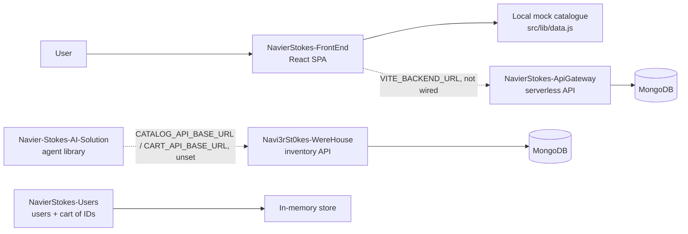
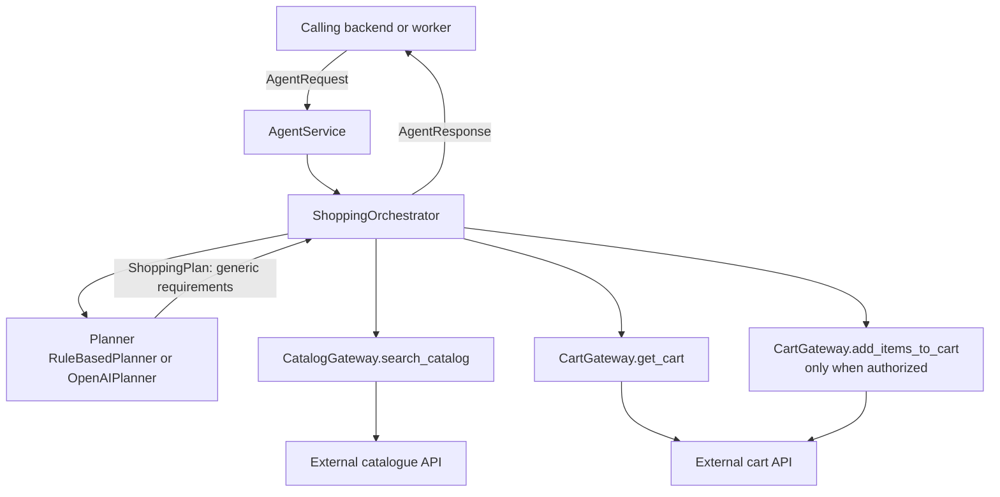

# NavierStokes AI Solution — `shopping-agent-core`

Reusable Python orchestration layer that turns a natural-language shopping request into a validated cart proposal
against catalogue and cart APIs owned by other services.

## Overview

`shopping-agent-core` is a **library, not a web service**. It exposes no HTTP endpoint of its own; the backend that
owns the user session imports `AgentService` and calls it.

The design separates two responsibilities that are usually conflated:

- A **planner** (rule-based or model-backed) reads the user's goal and emits *generic product requirements* —
  "flour", "eggs", "canvas". It never produces catalogue IDs, prices, stock, or availability.
- A **deterministic executor** queries the catalogue for each requirement, validates currency, stock, price, and
  budget, and only then — and only with the caller's explicit authorization — writes to the cart.

The model is never granted network access and never decides what a product costs. The only actions available to the
orchestrator are the `CatalogGateway` and `CartGateway` adapters.

## System context

MarkECIA is split across five independent repositories:

| Repository | Responsibility |
| --- | --- |
| [`NavierStokes-FrontEnd`](https://github.com/Navi3rSt0kes/NavierStokes-FrontEnd) | React SPA — storefront, cart, and shopping-assistant UI |
| [`NavierStokes-ApiGateway`](https://github.com/Navi3rSt0kes/NavierStokes-ApiGateway) | MongoDB-backed HTTP API (auth, products, cart, orders, rule-based agent chat) plus a separate local in-memory service sandbox |
| [`Navi3rSt0kes-WereHouse`](https://github.com/Navi3rSt0kes/Navi3rSt0kes-WereHouse) | Inventory API — catalogue CRUD, search, substitutes, cart validation, stock reservations |
| [`NavierStokes-Users`](https://github.com/Navi3rSt0kes/NavierStokes-Users) | Users API with a per-user cart that stores product IDs only |
| [`Navier-Stokes-AI-Solution`](https://github.com/Navi3rSt0kes/Navier-Stokes-AI-Solution) | `shopping-agent-core` — Python agent-orchestration library (planner + deterministic executor) *(this repository)* |

> **Integration status.** No repository calls another in code today. In the diagram below, solid arrows are calls that
> exist in source; dashed arrows are integration points that exist only as configuration.



## Features

- **Two interchangeable planners**: a deterministic rule-based planner for demos and tests, and an OpenAI-backed
  planner that returns a structured plan through strict function calling.
- **Deterministic executor** that owns every business decision: candidate filtering by currency and stock, budget
  enforcement, and the missing-requirement report.
- **Explicit write authorization**: a cart write happens only when the caller passes `cart_write_authorized=True`
  *and* the configured policy allows writes.
- **Idempotent cart writes** via a `uuid5` key derived from user, store, cart, conversation, and message.
- **Pluggable gateways**: `CatalogGateway` and `CartGateway` protocols, with HTTP adapters (timeout, retries with
  exponential backoff, optional bearer token) and in-memory mocks.
- **Typed contracts end to end** with Pydantic models.
- **Offline by default**: with no catalogue or cart base URL configured, mock gateways are used, so the demo and the
  tests need no API key and no network.

## Architecture



Request flow inside `ShoppingOrchestrator.run()`:

1. Read the current cart snapshot.
2. Ask the planner for a plan (at most 12 requirements).
3. For each requirement, search the catalogue and keep the gateway's first candidate whose currency matches and whose
   stock covers the requested quantity. The gateway owns relevance ranking; the executor does not re-rank.
4. Report `missing_products` if any required requirement went unmatched.
5. Report `budget_exceeded` if the current cart total plus the proposal exceeds `budget_minor`.
6. Report `needs_confirmation` if the write policy does not permit a write.
7. Otherwise write the items to the cart and report `completed`.

Any exception from a planner or an external API is converted into a `failed` response carrying the error in
`warnings` — the caller never receives a raw traceback.

## Tech Stack

| Layer | Technology |
| --- | --- |
| Language | Python `>=3.11` |
| Models / validation | Pydantic 2 |
| HTTP client | `httpx` (async) |
| LLM provider | OpenAI — Responses API with strict function calling |
| Tests | `pytest`, `pytest-asyncio` |
| Packaging | setuptools, `pyproject.toml` (distribution name `shopping-agent-core`) |

## Project Structure

```text
Navier-Stokes-AI-Solution/
├── agent_core/
│   ├── __init__.py          # public surface: AgentRequest, AgentResponse, AgentService
│   ├── service.py           # AgentService.create() wiring
│   ├── orchestrator.py      # deterministic execution and status decisions
│   ├── models.py            # Pydantic contracts
│   ├── policies.py          # CartWritePolicy
│   ├── prompts.py           # planner instructions
│   ├── config.py            # Settings.from_env()
│   ├── demo.py              # python -m agent_core.demo
│   ├── llm/
│   │   ├── openai_provider.py   # OpenAIPlanner
│   │   └── rule_based.py        # RuleBasedPlanner
│   └── tools/
│       ├── contracts.py     # CatalogGateway / CartGateway protocols
│       ├── http.py          # HTTP adapters
│       └── mock.py          # in-memory adapters for demo and tests
├── api/index.py             # Vercel stub — see Known gaps
├── tests/test_agent_service.py
├── README_AGENT.md          # usage and integration detail
└── ARCHITECTURE.md          # responsibilities and deliberate limits
```

## Prerequisites

- Python 3.11 or newer.
- An OpenAI API key **only** when using `AGENT_PLANNER=openai`.

## Installation

```powershell
python -m venv .venv
.\.venv\Scripts\Activate.ps1
python -m pip install -e ".[dev]"
```

## Running the demo

```bash
python -m agent_core.demo
```

The demo runs three requests against the mock gateways — a cake within budget, a painting request with write
authorization, and a cake with a budget too low — and prints each `AgentResponse` as JSON. No API key and no network
are required.

## Configuration

Copy `.env.example` to `.env`. The library reads the environment directly through `Settings.from_env()`; it does not
load `.env` files itself, so export the variables or use your own loader.

| Variable | Purpose | Required | Default |
| --- | --- | --- | --- |
| `AGENT_PLANNER` | Planner selection — `mock` or `openai`. Any other value raises at start-up | No | `mock` |
| `OPENAI_API_KEY` | OpenAI credential | Yes when `AGENT_PLANNER=openai`, otherwise the factory raises | none |
| `OPENAI_MODEL` | Model used by `OpenAIPlanner` | No | `gpt-4o-mini` |
| `CART_WRITE_POLICY` | `authorized_only` or `never`. Any other value raises | No | `authorized_only` |
| `HTTP_TIMEOUT_SECONDS` | Per-request timeout for the HTTP adapters | No | `10` |
| `HTTP_MAX_RETRIES` | Retries after a failed HTTP request, with exponential backoff | No | `2` |
| `SERVICE_API_TOKEN` | Sent as `Authorization: Bearer <token>` by both HTTP adapters | No | none |
| `CATALOG_API_BASE_URL` | Catalogue API root. When empty, `MockCatalogGateway` is used | No | none |
| `CATALOG_SEARCH_PATH` | Catalogue search path | No | `/products/search` |
| `CART_API_BASE_URL` | Cart API root. When empty, `MockCartGateway` is used | No | none |
| `CART_GET_PATH` | Cart read path, with a `{cart_id}` placeholder | No | `/carts/{cart_id}` |
| `CART_ADD_ITEMS_PATH` | Cart write path, with a `{cart_id}` placeholder | No | `/carts/{cart_id}/items` |
| `CORS_ORIGINS` | Comma-separated origins accepted by the Vercel stub in `api/index.py` | No | `https://markecia-web.vercel.app` |

Never commit real keys or tokens.

## Usage

```python
from agent_core import AgentRequest, AgentService

agent = AgentService.create()

result = await agent.run(AgentRequest(
    message="Quiero hacer una torta de chocolate para 8 personas",
    user_id="user-123",
    store_id="store-456",
    cart_id="cart-789",
    currency="COP",
    budget_minor=30_000,
    cart_write_authorized=False,
))

return result.model_dump()
```

With `cart_write_authorized=False` the result comes back as `needs_confirmation` and the cart is untouched. After the
user confirms in your application, resend the request with `cart_write_authorized=True`.

`AgentService.create()` also accepts explicit `settings`, `catalog`, and `cart` arguments, which is how the tests
inject custom gateways.

## Response statuses

| Status | Meaning | Cart modified |
| --- | --- | --- |
| `completed` | Authorized items were added to the cart | Yes |
| `needs_confirmation` | A proposal exists but write authorization is missing | No |
| `missing_products` | At least one required requirement had no valid candidate | No |
| `budget_exceeded` | The projected total exceeds `budget_minor` | No |
| `failed` | A planner or an external API was unavailable | No |

Every response carries `message`, `recommended_items`, `estimated_total`, `currency`, and, where relevant,
`cart_snapshot`, `cart_actions`, `missing_requirements`, `warnings`, and `metadata.plan_summary`. Amounts are integers
in the smallest currency unit (`price_minor`, `budget_minor`, `total_minor`).

## AI Agent

**Responsibility.** The planner turns a free-form goal into at most 12 generic requirements, each with a query, a
quantity between 1 and 50, a `required` flag, and optional string filters.

**Input.** `OpenAIPlanner` sends a JSON payload containing the message, currency, budget, and store ID, with
`PLANNER_INSTRUCTIONS` as the system instruction.

**Processing.** It calls the OpenAI **Responses API** with a single strict function tool, `submit_shopping_plan`, and
`tool_choice` forcing that tool. The arguments are validated into a `ShoppingPlan`; if the model returns no tool call,
the planner raises `The planning model did not return a shopping plan`.

**Output.** A `ShoppingPlan` of concepts. No prices, no IDs, no availability, and no chain-of-thought — the
instructions explicitly forbid all of them.

**Tools available to the agent.** Only the two gateway protocols. The model itself has no tools and no network access;
the orchestrator performs every call.

**Rule-based alternative.** `RuleBasedPlanner` recognizes cake, painting, and construction keywords and otherwise
forwards the raw message as a single requirement, letting the executor report it as missing rather than guess.

## External API contracts

The HTTP adapters expect these neutral shapes:

```text
POST {CATALOG_API_BASE_URL}{CATALOG_SEARCH_PATH}
  { "store_id", "query", "filters", "limit" }
  → { "products": [Product] }   or   [Product]

GET  {CART_API_BASE_URL}{CART_GET_PATH}
  → CartSnapshot

POST {CART_API_BASE_URL}{CART_ADD_ITEMS_PATH}      header: Idempotency-Key
  { "items": [CartItem] }
  → CartSnapshot
```

`Product`, `CartItem`, and `CartSnapshot` are defined in `agent_core/models.py`. When a real API has a different
shape, adapt the mapping in `agent_core/tools/http.py` or implement the protocols in `agent_core/tools/contracts.py`
— the orchestrator stays unchanged. See [README_AGENT.md](README_AGENT.md) for the integration walkthrough and
[ARCHITECTURE.md](ARCHITECTURE.md) for the component boundaries.

## Testing

```bash
python -m pytest
```

`tests/test_agent_service.py` covers the proposal path without write authorization, an authorized write, an unknown
need that must not invent products, budget rejection, a stock shortage reported as missing, and the invariant that
every selected ID comes from the catalogue gateway.

## Integration

- **Consumed by:** nothing in code yet. The library is meant to be imported by the backend that owns the session.
- **Consumes:** an external catalogue API and an external cart API, both configured by environment variable. Both base
  URLs are intentionally blank in `.env.example`, so mock gateways are active out of the box.
- The contracts above match **no route currently exposed** by `Navi3rSt0kes-WereHouse`, `NavierStokes-Users`, or
  `NavierStokes-ApiGateway`. Pointing this library at any of them requires either a custom gateway implementation or a
  mapping change in `agent_core/tools/http.py`.

## Known gaps

- `api/index.py`, the Vercel entry point, **does not import `agent_core`**. It answers `GET` with
  `{"status": "ok", "service": "ai-agent"}` and any `POST` carrying a `message` with a fixed string and an empty
  `recommendations` list. Deploying this repository as-is therefore does not expose the agent.
- `agent.py` at the repository root is an empty file.
- `_select_candidate` keeps the gateway's first valid candidate, so relevance quality depends entirely on the
  catalogue API's ranking.
- Reservation, checkout, conversation persistence, and inventory storage are deliberately out of scope; see
  [ARCHITECTURE.md](ARCHITECTURE.md).


